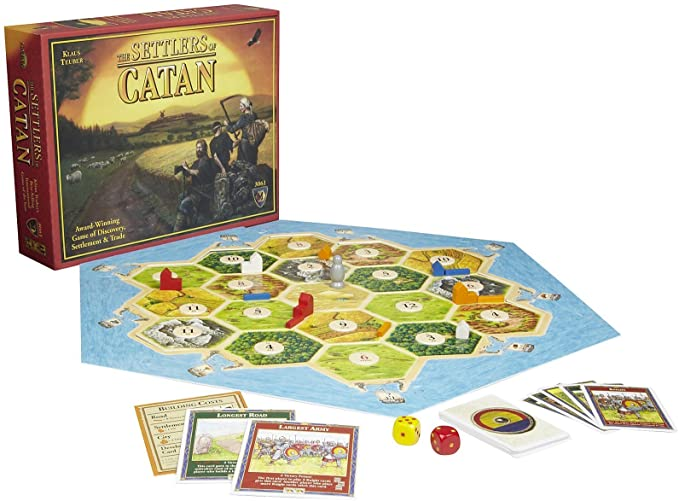

# Logical Modelling in Settlers of Catan

  

## About

This project was done as a part of CISC204 - Logic in Computing Science at Queen's University in fall of 2020 by Barrett Arbour, Cameron Beaulieu, Jimmy Lu, and Brandon Ye. Using techniques in propositional and predicate logic, we seek to model and solve a hypothetical problem faced in a slightly altered game of Settlers of Catan.

## Project Summary

Given a certain board state in Settlers of Catan, where we know which tiles of a certain resource type (wood, sheep, wheat, and brick) are connected to which other tiles, as well as the set of resources <em>S</em> needed to be gathered in order to win the game, we would like to determine if there exists a winning branch with <em>k</em> or lower steps (that is, a size of <em>k-1</em> or lower). We will take as input a series of implications defining the board state, the set of required resources, as well as the maximum possible value of <em>k</em> we would like to consider.

## Usage

After installing the NNF python library with `pip3 install nnf`, running `run.py` will build logical model and test for a solution using the information specified in the variables `givenBoardCondition`, `S`, and `k`.

## Learn More

A powerpoint file thoroughly detailing the full project and development process can be found in `documents/final/modelling_report.pptx`
